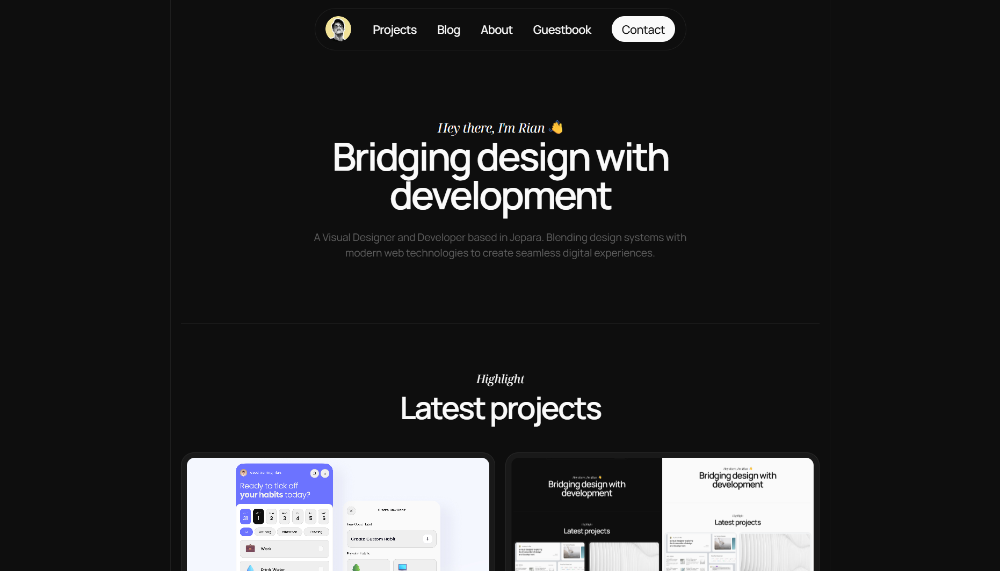

# 🌟 Personal Portfolio Website

> Modern, responsive portfolio built with Next.js 15 and cutting-edge web technologies. Showcase your projects, blog posts, and professional journey with style.

[](https://nextjs.org/)
[](https://www.typescriptlang.org/)
[](https://tailwindcss.com/)
[](LICENSE)



## Features

**Modern Design** — Clean, responsive interface optimized for all devices  
**Blog & Portfolio** — Dynamic content management with Notion CMS  
**Interactive Guestbook** — Visitor engagement with social authentication  
**Contact Forms** — Direct communication via Formspree integration  
**Performance First** — Lightning-fast loading with Next.js optimizations  
**Theme Support** — Dark/light mode with smooth transitions  
**SEO Ready** — Optimized for search engines and social sharing  
**Syntax Highlighting** — Beautiful code blocks with Prism.js support

## Tech Stack

This website is built using these technologies:

- ◼️ **Next.js 15** — React framework for building fast, SEO-friendly web apps
- ⚛️ **React 19** — UI library for creating interactive components
- 🔰 **TypeScript** — Strongly typed JavaScript for better maintainability
- 💠 **Tailwind CSS 4** — Utility-first CSS framework for rapid styling
- 🔥 **Firebase** — Authentication (Google & GitHub) and backend services
- 🦫 **Supabase** — Database and storage for guestbook and profile images
- 📜 **Notion API** — Headless CMS for managing blog and portfolio content
- ➰ **Framer Motion** — Smooth and interactive animations
- 🎨 **Prism.js** — Syntax highlighting for code blocks with 15+ language support

## Quick Start

### Prerequisites

- Node.js 18+
- npm/yarn/pnpm
- Git

### Installation

```bash
# Clone repository
git clone https://github.com/rianmubarok/itsRian.git
cd itsRian

# Install dependencies
npm install

# Setup environment
cp .env.example .env.local

# Start development server
npm run dev
```

Open [http://localhost:3000](http://localhost:3000) to see your portfolio!

## Configuration

Create `.env.local` with your credentials:

```env
# Notion CMS
NOTION_TOKEN=your_notion_integration_token
NOTION_DATABASE_ID=your_blog_database_id
NOTION_PROJECTS_DATABASE_ID=your_portfolio_database_id

# Supabase Database
NEXT_PUBLIC_SUPABASE_URL=your_supabase_url
NEXT_PUBLIC_SUPABASE_ANON_KEY=your_supabase_anon_key
SUPABASE_SERVICE_ROLE_KEY=your_service_role_key

# Firebase Auth
NEXT_PUBLIC_FIREBASE_API_KEY=your_firebase_api_key
NEXT_PUBLIC_FIREBASE_AUTH_DOMAIN=your_auth_domain
NEXT_PUBLIC_FIREBASE_PROJECT_ID=your_project_id
NEXT_PUBLIC_FIREBASE_APP_ID=your_app_id

# Contact Form
NEXT_PUBLIC_FORMSPREE_FORM_ID=your_formspree_form_id
```

### 📝 Notion Setup

**Important**: This project uses **two separate Notion databases**:

- **Blog Database** for blog posts and articles
- **Portfolio Database** for projects and portfolio items

1. Create integration at [Notion Developers](https://www.notion.so/my-integrations)
2. Create **two separate databases**:
   - **Blog Database** (for blog posts)
   - **Portfolio Database** (for projects)
3. Share both databases with your integration
4. Copy database IDs from URLs
5. Use separate database IDs in your `.env.local`:
   - `NOTION_DATABASE_ID` = Blog database ID
   - `NOTION_PROJECTS_DATABASE_ID` = Portfolio database ID

**Database Properties Structure:**

**Blog Database Properties:**

- `title` (Title) - Blog post title
- `slug` (Text) - URL-friendly identifier
- `description` (Text) - Brief description (Optional)
- `tags` (Multi-select) - Categories/tags (Optional)
- `date` (Date) - Publication date
- `readingTime` (Text) - Estimated reading time (Optional)
- `thumbnail` (URL) - Featured image (Optional)
- `ogImage` (URL) - Open Graph image for social sharing (Optional)
- `contentEn` (Text) - English content (Markdown)
- `contentId` (Text) - Indonesian content (Markdown) (Optional)

**Portfolio Database Properties:**

- `title` (Title) - Project name
- `slug` (Text) - URL-friendly identifier
- `description` (Text) - Project description (Optional)
- `content` (Text) - Detailed project information (Markdown) (Optional)
- `thumbnail` (URL) - Project screenshot (Optional)
- `ogImage` (URL) - Open Graph image for social sharing (Optional)
- `tags` (Multi-select) - Technologies used
- `createdAt` (Date) - Project creation date
- `sourceCode` (URL) - GitHub/repository link (Optional)
- `liveProject` (URL) - Live demo link (Optional)

Tip. Markdown content can also use external links with the `.md` extension.

### 🗄️ Supabase Setup

1. Create project at [Supabase](https://app.supabase.com/)
2. Copy Project URL and API keys from Settings > API
3. Create tables using SQL Editor:

```sql
-- Guestbook
create table guestbook (
  id uuid primary key default uuid_generate_v4(),
  name text not null,
  message jsonb not null,
  date timestamp with time zone not null default now(),
  profile_pic text,
  email text,
  is_author boolean not null default false
);

-- Blog views tracking
create table blog_views (
  slug text primary key,
  count integer not null default 0
);
```

Notes:

- Optional fields: `profile_pic`, `email`
- Defaults: `date` defaults to now, `is_author` defaults to false

### 🔥 Firebase Setup

1. Create project at [Firebase Console](https://console.firebase.google.com/)
2. Enable Google & GitHub authentication
3. Copy web app config values

### 📬 Formspree Setup

1. Create form at [Formspree](https://formspree.io/)
2. Copy form ID for contact integration

## Project Structure

```
├── app/                # Next.js 15 App Router
├── components/         # Reusable UI components
│   ├── shared/ui/     # Common UI components including CodeBlock
│   └── blog/          # Blog-specific components
├── lib/               # Utilities & configurations
│   ├── notion.ts      # Notion client configuration
│   ├── notion-service.ts # Blog content service
│   └── projects-service.ts # Project content service
├── public/            # Static assets
├── types/             # TypeScript definitions
├── styles/            # CSS files including Prism.js themes
└── data/              # Static content
```

## Deployment

### Vercel (Recommended)

1. Connect GitHub repo to [Vercel](https://vercel.com/)
2. Set environment variables
3. Deploy automatically on push

## Perfect For

- **Developers** showcasing technical projects
- **Designers** presenting portfolios
- **Students** building professional presence
- **Freelancers** attracting clients
- **Professionals** establishing online brand

## Support

Found this helpful?

- ⭐ Star the repo
- 🐛 Report issues
- 🔧 Contribute improvements
- 📢 Share with others

## License

MIT License — feel free to use for personal or commercial projects, see [LICENSE](LICENSE) file for details.
